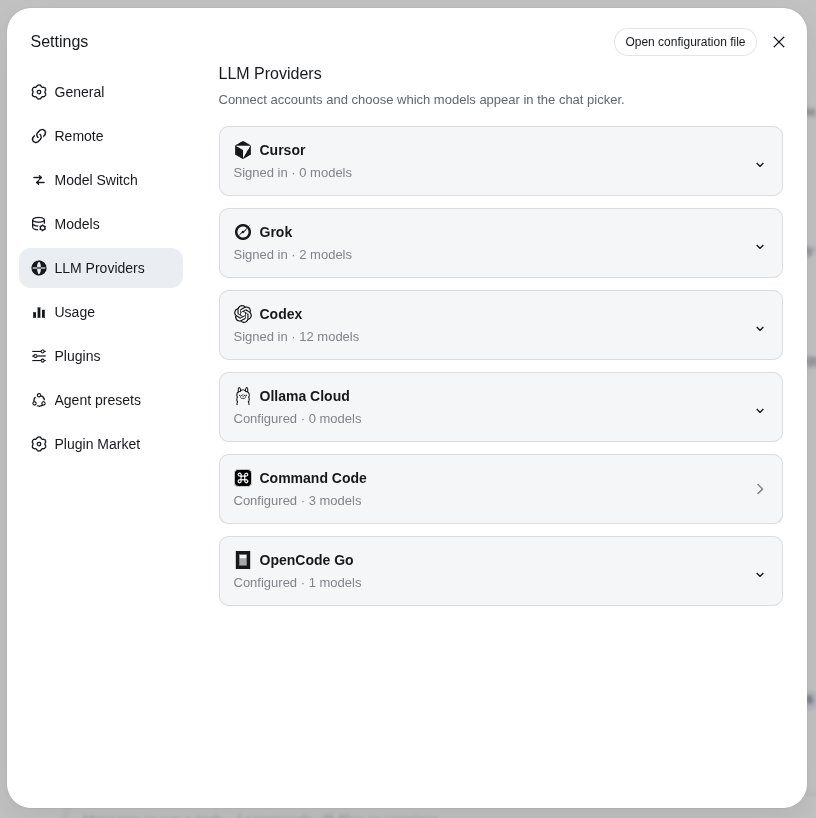
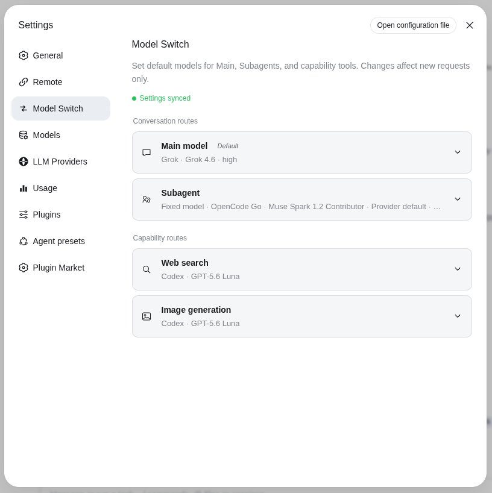
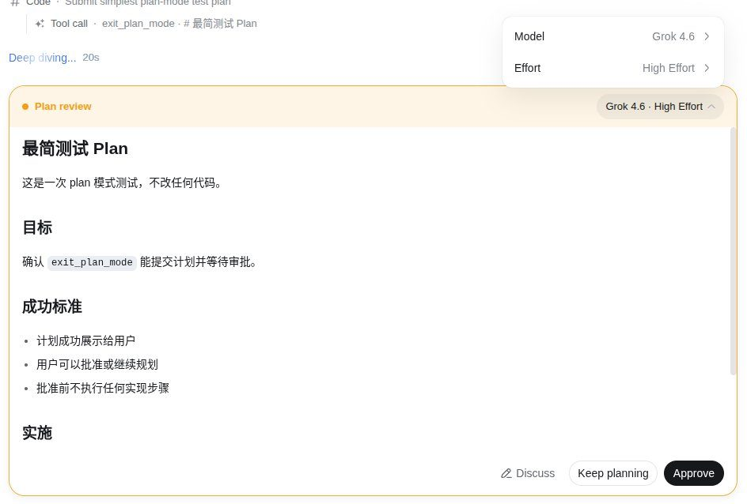
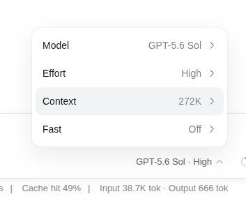
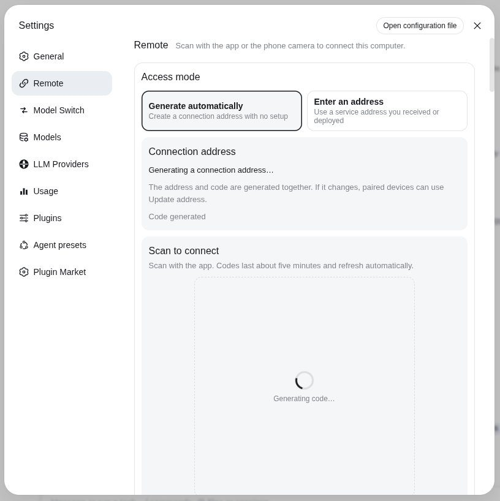
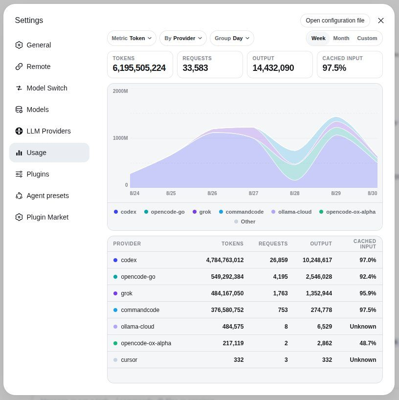

# NOirBRight DSH Plugins & Mobile

[English](README.md) | 中文

[NOirBRight](https://github.com/NOirBRight) 发布的 DSH 插件及手机配套应用独立机器可读目录。本项目与 DeepSeek 及各条目所涉及的第三方服务商无隶属关系，也不代表其认可或背书。

> **安全提示：** DSH 插件及配套应用以用户授予的权限执行代码，可能处理文件、凭据、会话数据或网络访问。安装前请审查源码及披露标记。Latest URL 跟随正式资产，同时提供固定版本 URL 和 SHA-256 以便可复现安装。

> **Alpha.4 兼容性：** 迁移版本严格面向 DeepSeek Harness `0.1.2-alpha.4` 和 `@deepseek-ai/cordis@4.0.2`，不兼容 Alpha.1–Alpha.3。仍使用旧 Runtime 的用户应继续固定该 Runtime 对应的最后兼容插件 tag，不要把 Alpha.4 tarball 安装到旧 profile。详见[兼容性与回滚策略](docs/alpha4-release-compatibility.md)及[本次 campaign 验收记录](docs/alpha4-campaign-evidence.md)。

## 目录

### 模型与 Provider

| 条目 | 类型 | 版本 | 状态 | 简介 | 披露 |
|---|---|---:|---|---|---|
| [dsh-llm-codex](https://github.com/NOirBRight/dsh-llm-codex) | 插件 | [v0.3.20](https://github.com/NOirBRight/dsh-llm-codex/tree/v0.3.20) | 维护中 | ChatGPT Codex 订阅登录、可排序模型目录、Fast 与 1M 变体、实时额度，以及可选搜索和图像工具。 | 凭据, 网络, OAuth, 第三方服务, 订阅账号 |
| [dsh-llm-commandcode](https://github.com/NOirBRight/dsh-llm-commandcode) | 插件 | [v0.1.31](https://github.com/NOirBRight/dsh-llm-commandcode/tree/v0.1.31) | 维护中 | Command Code Provider API 聊天，模型发现和凭据存储均由 Host 持有，并提供 best-effort 订阅用量展示。 | 凭据, 网络, 第三方服务, 订阅账号, 非官方接口 |
| [dsh-llm-cursor](https://github.com/NOirBRight/dsh-llm-cursor) | 插件 | [v0.2.23](https://github.com/NOirBRight/dsh-llm-cursor/tree/v0.2.23) | 维护中 | 非官方 Cursor 订阅登录与聊天，Host 持有 PKCE 凭据，并提供模型发现与订阅用量展示。 | 封号风险, 凭据, 网络, OAuth, 第三方服务, 订阅账号, 非官方接口 |
| [dsh-llm-grok](https://github.com/NOirBRight/dsh-llm-grok) | 插件 | [v0.3.17](https://github.com/NOirBRight/dsh-llm-grok/tree/v0.3.17) | 维护中 | xAI Grok 订阅登录与 Responses 聊天，提供可配置模型、用量展示、服务端搜索和 Imagine 生图。 | 凭据, 网络, OAuth, 第三方服务, 订阅账号 |
| [dsh-llm-ollama](https://github.com/NOirBRight/dsh-llm-ollama) | 插件 | [v0.6.24](https://github.com/NOirBRight/dsh-llm-ollama/tree/v0.6.24) | 维护中 | 通过 OpenAI 兼容适配器接入 Ollama Cloud 聊天，并提供原生模型发现及 Web Search、Fetch provider。 | 凭据, 网络, 第三方服务 |
| [dsh-llm-opencode-go](https://github.com/NOirBRight/dsh-llm-opencode-go) | 插件 | [v0.1.29](https://github.com/NOirBRight/dsh-llm-opencode-go/tree/v0.1.29) | 维护中 | OpenCode Go 模型集成，按模型路由 Completions、Responses 或 Anthropic Messages，并提供发现和订阅用量。 | 凭据, 网络, 第三方服务, 订阅账号 |

### 界面

| 条目 | 类型 | 版本 | 状态 | 简介 | 披露 |
|---|---|---:|---|---|---|
| [dsh-buddy](https://github.com/NOirBRight/dsh-buddy) | 插件 | [v0.1.0](https://github.com/NOirBRight/dsh-buddy/tree/v0.1.0) | 已隔离 | AM01S USB 副屏上的像素鲸鱼看板与触控遥控器，显示 DSH 状态、会话、审批和问题。 | 网络, 远程访问, 界面扩展 |
| [dsh-codex-sidebar](https://github.com/NOirBRight/dsh-codex-sidebar) | 插件 | [v0.5.12](https://github.com/NOirBRight/dsh-codex-sidebar/tree/v0.5.12) | 维护中 | 为一条 DSH 主会话提供 Codex 风格右侧栏，Files、Review、Browser 与 Terminal 共用标签栏。 | 浏览器自动化, 网络, 子进程, 界面扩展 |
| [dsh-composer-picker](https://github.com/NOirBRight/dsh-composer-picker) | 插件 | [v0.1.3](https://github.com/NOirBRight/dsh-composer-picker/tree/v0.1.3) | 已弃用 | 纯客户端后缀分组 Composer 模型选择器，带独立 Plan Review，不依赖具体 Provider 运行时。 | 界面扩展 |
| [dsh-llm-providers-ui](https://github.com/NOirBRight/dsh-llm-providers-ui) | 插件 | [v0.2.9](https://github.com/NOirBRight/dsh-llm-providers-ui/tree/v0.2.9) | 维护中 | 共享 LLM Providers 设置 Owner，统一管理 Provider 卡片、导航和独立模型插件之间的持久化排序。 | 界面扩展 |
| [dsh-model-switch](https://github.com/NOirBRight/dsh-model-switch) | 插件 | [v0.4.11](https://github.com/NOirBRight/dsh-model-switch/tree/v0.4.11) | 维护中 | 为 Main、Subagent、Composer、Plan Review、Web Search 和图像生成提供显式路由，不修改 DSH Core。 | 界面扩展 |

### 助手

| 条目 | 类型 | 版本 | 状态 | 简介 | 披露 |
|---|---|---:|---|---|---|
| [dsh-ainvestor](https://github.com/NOirBRight/dsh-ainvestor) | 插件 | [v0.1.2](https://github.com/NOirBRight/dsh-ainvestor/tree/v0.1.2) | 维护中 | AiInvestor 分析助手，以 Host 工具提供 A 股缠论、综合评分、财务数据和本地投资知识库。 | 网络, 第三方服务, 界面扩展 |
| [dsh-external-agents](https://github.com/NOirBRight/dsh-external-agents) | 插件 | [v0.2.5](https://github.com/NOirBRight/dsh-external-agents/tree/v0.2.5) | 维护中 | 外部 Agent 控制面，接入 Codex、Claude Code、Cursor Agent 与 Antigravity，并提供设置和后台任务可见性。 | 凭据, 网络, 子进程, 界面扩展 |
| [dsh-llm-assistant](https://github.com/NOirBRight/dsh-llm-assistant) | 插件 | [v0.1.5](https://github.com/NOirBRight/dsh-llm-assistant/tree/v0.1.5) | 已隔离 | 常驻 DeepSeek 助手席位，拥有独立会话历史、提醒、交接和按需只读任务引用。 | 网络, 会话数据, 界面扩展 |
| [dsh-ponytail](https://github.com/NOirBRight/dsh-ponytail) | 插件 | [v0.2.6](https://github.com/NOirBRight/dsh-ponytail/tree/v0.2.6) | 维护中 | Ponytail 会话模式与审查技能，提供模式持久化、Native Subagent 继承和精简运行时提示。 | 会话数据, 界面扩展 |

### 远程访问

| 条目 | 类型 | 版本 | 状态 | 简介 | 披露 |
|---|---|---:|---|---|---|
| [dsh-mobile](https://github.com/NOirBRight/dsh-mobile) | 配套应用 | [v1.1.14](https://github.com/NOirBRight/dsh-mobile/tree/v1.1.14) | 维护中 | 连接自有 DSH Host 的 Android 配套应用，提供扫码配对、端到端加密隧道、官方功能和手机布局。 | 凭据, 网络, 远程访问 |
| [dsh-mobile-pairing](https://github.com/NOirBRight/dsh-mobile-pairing) | 插件 | [v0.1.18](https://github.com/NOirBRight/dsh-mobile-pairing/tree/v0.1.18) | 维护中 | DSH Mobile Host 配对插件，提供回环网关、公网端点发现、WebRTC Direct 和加密隧道回退。 | 凭据, 网络, 远程访问 |

### 用量与可观测性

| 条目 | 类型 | 版本 | 状态 | 简介 | 披露 |
|---|---|---:|---|---|---|
| [dsh-usage-monitor](https://github.com/NOirBRight/dsh-usage-monitor) | 插件 | [v0.2.14](https://github.com/NOirBRight/dsh-usage-monitor/tree/v0.2.14) | 维护中 | 会话日志用量看板，展示 token、请求、输出和缓存命中率，并按供应商、模型或工作区分组。 | 会话数据, 界面扩展 |

## 这些插件做什么

下面的截图展示这些插件加入的设置页和对话界面。图注只描述画面内容，不构成对所涉第三方服务的背书。

### LLM 提供商

在设置 → LLM 提供商中接入额外模型源。登录或配置完成后，这些模型会出现在对话选择器里，并可被独立路由。

设置 → LLM 提供商页面，列出 Cursor、Grok、Codex、Ollama Cloud、Command Code 和 OpenCode Go。

相关条目：[dsh-llm-providers-ui](https://github.com/NOirBRight/dsh-llm-providers-ui), [dsh-llm-cursor](https://github.com/NOirBRight/dsh-llm-cursor), [dsh-llm-grok](https://github.com/NOirBRight/dsh-llm-grok), [dsh-llm-codex](https://github.com/NOirBRight/dsh-llm-codex), [dsh-llm-ollama](https://github.com/NOirBRight/dsh-llm-ollama), [dsh-llm-commandcode](https://github.com/NOirBRight/dsh-llm-commandcode), [dsh-llm-opencode-go](https://github.com/NOirBRight/dsh-llm-opencode-go)

### 模型路由

分别为 Main、Subagent、Composer、Plan Review、Web Search 和图像生成指定模型。设置只影响新请求，进行中的任务仍沿用原路由。

设置 → 模型路由页面：Main 使用 Grok，Subagent 使用 OpenCode Go，Web Search 和图像生成使用 Codex。

相关条目：[dsh-model-switch](https://github.com/NOirBRight/dsh-model-switch)

### Composer 与 Plan Review

当前路由插件同时接管 Composer 模型选择器和 Plan Review 卡片。批准计划前可切换 Fast、上下文、effort 和执行模型。dsh-composer-picker 是最初的选择器，现已弃用。

Plan Review 卡片，含 Discuss、Keep planning、Approve，以及可切换执行模型和 effort 的弹出菜单。

Composer 弹出菜单，显示 GPT-5.6 Sol 的 Model、Effort、Context 和 Fast 选项。

相关条目：[dsh-model-switch](https://github.com/NOirBRight/dsh-model-switch), [dsh-composer-picker](https://github.com/NOirBRight/dsh-composer-picker)

### 手机远程

把手机配对到这台 Host。dsh-mobile-pairing 生成短时二维码和加密隧道；dsh-mobile Android 应用扫码后仍连接到你自己的机器。

设置 → 远程页面正在自动生成连接地址和配对二维码。

相关条目：[dsh-mobile-pairing](https://github.com/NOirBRight/dsh-mobile-pairing), [dsh-mobile](https://github.com/NOirBRight/dsh-mobile)

### 用量

从会话日志读取 token 用量，并按供应商、模型或工作区作图。它不会向各供应商拉取订阅额度。

设置 → 用量看板，按供应商展示 token、请求、输出和缓存命中。

相关条目：[dsh-usage-monitor](https://github.com/NOirBRight/dsh-usage-monitor)

## 特定政策提示

- **[dsh-llm-commandcode](https://github.com/NOirBRight/dsh-llm-commandcode)** — 聊天使用文档化 Provider API；可选额度展示还会读取官方 CLI 使用的非公开账户接口。
- **[dsh-llm-cursor](https://github.com/NOirBRight/dsh-llm-cursor)** — Cursor 员工认定此类私有客户端访问违反其服务条款。仅安装、登录或发送聊天就可能导致账号受限或封禁。
- **[dsh-llm-ollama](https://github.com/NOirBRight/dsh-llm-ollama)** — 已发布并部署到 Alpha.4 Host，已验证配置恢复和 Settings 加载；因 Ollama 额度耗尽，真实 discovery 和聊天记为 SKIP-QUOTA。
- **[dsh-buddy](https://github.com/NOirBRight/dsh-buddy)** — 因当前版本尚未完成 Alpha.4 迁移和交互验收，本次不发布 Buddy。仅应在其兼容 Alpha.1 的 Runtime 中继续使用。
- **[dsh-composer-picker](https://github.com/NOirBRight/dsh-composer-picker)** — 该插件已并入 dsh-model-switch。请勿同时安装，两者会竞争同一个选择器位置。
- **[dsh-llm-assistant](https://github.com/NOirBRight/dsh-llm-assistant)** — 因当前版本尚未完成 Alpha.4 迁移和交互验收，本次不发布 Assistant。仅应在其历史兼容 Runtime 中继续使用。
- **[dsh-ponytail](https://github.com/NOirBRight/dsh-ponytail)** — 本次 Alpha.4 campaign 新增部署。模式变更在新的 accepted step 生效，并写入会话日志。
- **[dsh-mobile](https://github.com/NOirBRight/dsh-mobile)** — 需要在 Host 安装 dsh-mobile-pairing。v1.1.14 是 versionCode 27 的正式签名 APK，包含 IndexedDB Host 插件缓存、移动布局和插件设置界面。
- **[dsh-mobile-pairing](https://github.com/NOirBRight/dsh-mobile-pairing)** — 此版本使用 @dsh-mobile/e2e-tunnel v0.1.6。Host 上的设备密钥会保留；二维码、Direct 和 Relay 检查需与已配对手机一起执行。

## 外部上游包

- [dshmarket 1.40.0](https://www.npmjs.com/package/dshmarket/v/1.40.0) 是 [dsh-market/dsh-market](https://github.com/dsh-market/dsh-market) 发布的外部上游包，不由本目录发布。它已在 3080 Alpha.4 profile 中加载并完成检查；仅应作为受控 profile 依赖安装。

## 安装

日常更新请使用 [dist/index.json](dist/index.json) 中的 Latest 命令；需要可复现部署时使用固定版本命令。依赖共享 UI Owner 的 Provider 会按依赖顺序列出两条命令：

**Latest：**

    dsh plugin --profile web add --force https://github.com/NOirBRight/dsh-llm-providers-ui/releases/latest/download/dsh-llm-providers-ui-0.2.9.tgz
    dsh plugin --profile web add --force https://github.com/NOirBRight/dsh-llm-codex/releases/latest/download/dsh-llm-codex-0.3.20.tgz

**固定版本：**

    dsh plugin --profile web add --force https://github.com/NOirBRight/dsh-llm-providers-ui/releases/download/v0.2.9/dsh-llm-providers-ui-0.2.9.tgz
    dsh plugin --profile web add --force https://github.com/NOirBRight/dsh-llm-codex/releases/download/v0.3.20/dsh-llm-codex-0.3.20.tgz

Latest URL 指向当前带版本号的正式资产，并会随 catalog release 一起更新；固定 URL 指向正式 release tag。GitHub 包构建脚本可能在 agent 沙箱之外执行，安装前请审查源码和 SHA256SUMS。

## 手机应用

- [下载最新版 dsh-mobile-1.1.14.apk](https://github.com/NOirBRight/dsh-mobile/releases/latest/download/dsh-mobile-1.1.14.apk)
- [下载固定版 dsh-mobile-1.1.14.apk](https://github.com/NOirBRight/dsh-mobile/releases/download/v1.1.14/dsh-mobile-1.1.14.apk)
- SHA-256：92e3e2ec4c7d74a6a178a5ff0b3cbf5abb6937a2cbad7a283415d6c031f59bbc
- Host 要求：先安装 dsh-mobile-pairing。

## 数据与维护

- catalog/*.json 是经审核的数据源。
- README.md、README.zh.md 与 dist/index.json 均由脚本生成。
- npm run verify:remote 检查仓库公开性、tag、commit SHA、包身份、插件 manifest 和配套应用发布资产。

目录数据采用 [CC0-1.0](DATA_LICENSE.md)，仓库工具代码采用 [MIT](LICENSE)。

## 免责声明

本目录记录事实性披露，不构成安全认证。服务名称及商标归各自权利人所有；各条目仍受适用的服务商条款约束。
